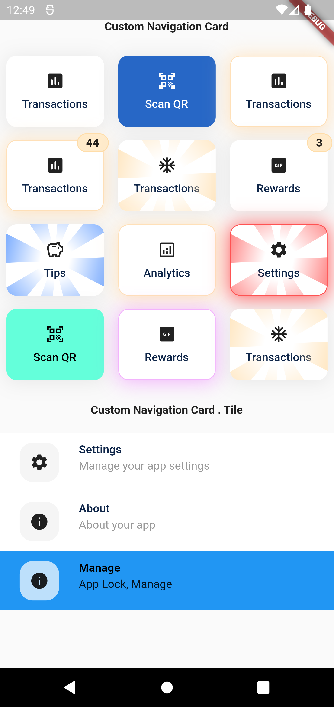

# ATOA FLUTTER PACKAGES

## List of Packages

### Getting Started

To get started, as this packages are contained in private repo, so we need to connect using SSH in our project

Make sure to set up SSH with a common host **atoa.github.com**, so to avoid conflicts while using dependencies in project

- Example(SSH Config):-

```
# Work - Work
Host atoa.github.com
   HostName github.com
   User git
   IdentityFile ~/.ssh/id_rsa_work
```

### 1. Custom Navigation grid

#### ScreenShots

|                                                  1                                                   |
| :--------------------------------------------------------------------------------------------------: |
|  |

#### Usage

- Add dependecies

```yaml
dependencies:
  custom_navigation_card:
    git:
      url: git@atoa.github.com:ATOAPaymentsLimited/atoa-flutter-packages.git
      ref: main
      path: packages/custom_navigation_card
```

Need to include the import the package to the dart file where it will be used, use the below command,

```dart
import 'package:custom_navigation_card/custom_navigation_card.dart';
```
